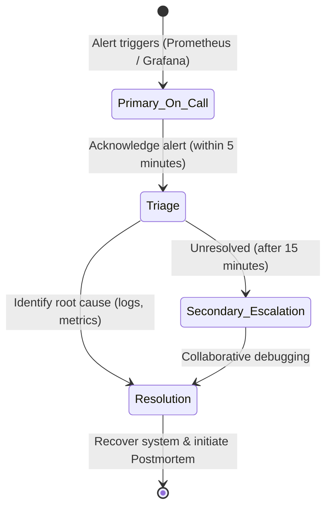

# Team SRE Workflow & Collaboration Guide

This document defines the team organization, Git branching policies, SRE review gates, on-call incident management, and CI/CD operations for the SRE End-Term Project.

---

## 1. Team Roles & Responsibilities

To achieve a reliability-first culture, our team is organized into the following key roles:

| Role | Primary Responsibilities | Team Member(s) |
| :--- | :--- | :--- |
| **SRE Lead / Reliability Engineer** | Oversees SLOs/SLIs, manages error budgets, coordinates postmortems, and directs disaster recovery dry-runs. | *Reliability Champion* |
| **DevSecOps & IaC Architect** | Provisioning AWS cloud infrastructure via Terraform, configuring virtual machines/nodes via Ansible playbooks. | *Infrastructure Lead* |
| **Orchestration Specialist** | Managing cluster life cycles (Docker Swarm / Kubernetes manifests), HPA parameters, and self-healing configurations. | *Cluster Engineer* |
| **Observability Engineer** | Setting up Prometheus scraping configs, alerts in `alert_rules.yml`, and designing custom Grafana dashboards. | *Monitoring Lead* |
| **Backend & Quality Engineer** | Implementing microservices, writing FastAPI logic, and maintaining code coverage via robust pytest suites. | *Software Engineers* |

---

## 2. Git Branching & Collaboration Strategy

Our team utilizes the **GitHub Flow** branching model with strict protection rules applied to the `main` branch to guarantee high codebase integrity.

### 2.1 Branch Naming Conventions
- `feat/feature-name`: For introducing new features or microservice modifications.
- `bugfix/issue-description`: For resolving bugs, crashes, or SLO leaks.
- `iac/terraform-ansible-changes`: For cloud infrastructure or configuration edits.
- `ops/monitoring-alerting-updates`: For metrics, dashboards, or alerting rules.

### 2.2 Branch Lifecycle
```mermaid
gitGraph
  commit id: "Initial commit"
  branch feat/user-service
  checkout feat/user-service
  commit id: "Add profile endpoint"
  commit id: "Add unit tests"
  checkout main
  merge feat/user-service id: "PR Merge (CI/CD Passed)"
  branch ops/alert-rules
  checkout ops/alert-rules
  commit id: "Add CPU usage alerts"
  checkout main
  merge ops/alert-rules id: "PR Merge (CI/CD Passed)"
```

---

## 3. Automated SRE Merging Gates (Pull Requests)

Every Pull Request targeting `main` must pass the following **SRE Quality Gates** before it can be merged:

1. **Peer Review**: At least one other team member must approve the PR.
2. **Automated CI/CD Verification**: The GitHub Actions pipeline must complete successfully:
   - Python code must pass standard PEP8 validation (`flake8`).
   - Terraform manifests must pass formatting (`fmt`) and validation (`validate`).
   - Ansible playbooks must pass syntax checks.
   - All unit tests across the 6 microservices must pass with `pytest`.
   - Docker configurations must check out successfully (`docker compose config`).
3. **SLO Impact Assessment**: Any changes to core service logic (e.g. `order-service` database operations) must include a pre-assessment of their impact on:
   - Latency SLO (Target: $\le 200\text{ ms}$)
   - Availability SLO (Target: $\ge 99.9\%$)

---

## 4. Team On-Call Rotation & Incident Response

To support high service reliability, the team operates an on-call rotation:



### 4.1 Alerting Thresholds
- **Critical (P0)**: Service down (`up == 0`), or Order Service crash (`order_service_status == 0`). Action: Immediate alert to the on-call engineer.
- **Warning (P1)**: High CPU usage ($> 80\%$), or warning-level response latency. Action: Slack notification to team channel for inspection.

### 4.2 Collaborative Postmortem Workflow
When an incident is resolved (e.g., our Order Service database failure simulation), the team meets to perform a collaborative **Root Cause Analysis (RCA)**. The SRE Lead coordinates:
1. Drafting the incident history timeline.
2. Documenting the diagnostic steps taken and logs examined.
3. Defining actionable preventive measures to include in the roadmap.
4. Archiving the report in `docs/INCIDENT_POSTMORTEM.md`.

---

## 5. CI/CD Operations Guide

Our automated CI/CD pipeline located in [`.github/workflows/cicd.yml`](../.github/workflows/cicd.yml) acts as the continuous quality sentinel for the team.

- **On Pull Request**: Validates code quality, playbook syntax, cloud infrastructure compliance, and code logic stability. Prevents broken contributions from merging.
- **On Push to Main**: Deploys changes with zero downtime. Runs post-deployment validations (`scripts/health_check.sh`) to guarantee that the system remains online post-delivery.
